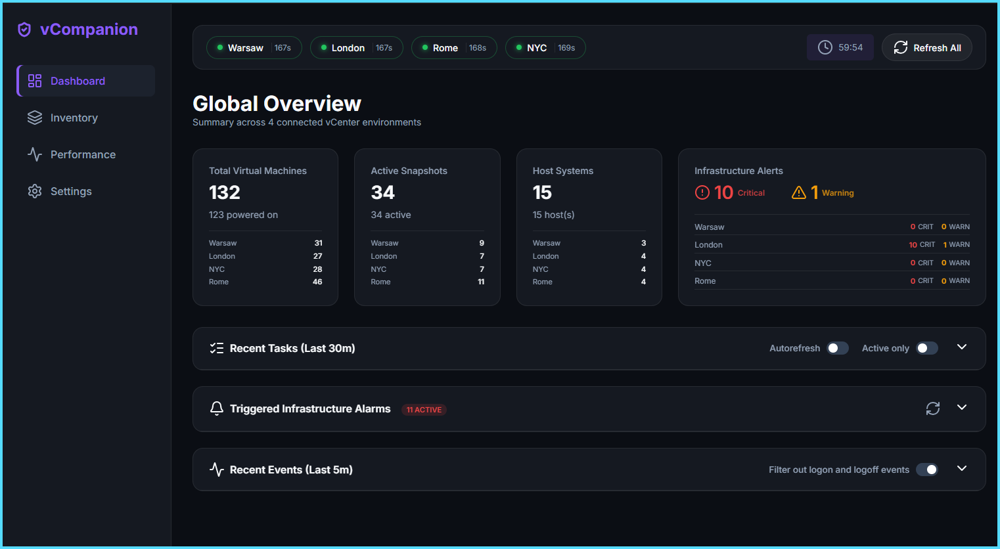
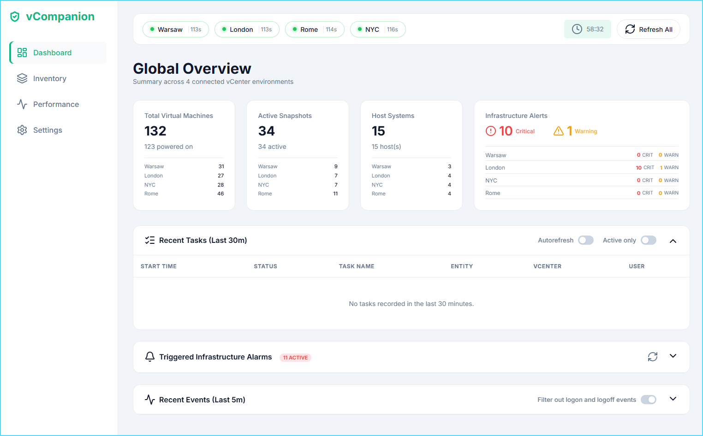
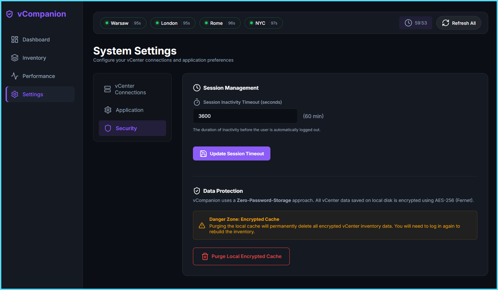

# 🛡️ vCompanion

[](https://www.python.org/)
[](https://www.vmware.com/products/vsphere.html)
[](LICENSE)
[]()

**vCompanion** is a high-end, unified management dashboard designed for vSphere administrators. It allows you to oversee multiple, non-federated vCenter environments through a single, stunning web interface.

> [!NOTE]
> Designed for simplicity. Built for performance. Dedicated to administrators who manage diverse vSphere environments without the complexity of full federation.

---

## 📸 Screenshots

### Dashboard - Dark Mode

*Real-time monitoring with alerts, resource distribution, and performance metrics*

### Dashboard - Light Mode

*Clean, modern interface with customizable themes*

### Settings Panel

*Comprehensive configuration for vCenter connections, themes, and security*

---

## ✨ Key Features

### 🌐 Multi-vCenter Management
*   **Unified Inventory**: A clean, consistent view of all your resources (VMs, Hosts, Networks, Storage) across multiple vCenters
*   **Zero Federation Required**: Manage independent vCenter environments without complex federation setup
*   **Dynamic Status Indicators**: Real-time connection status with countdown timers and refresh progress
*   **Background Synchronization**: Intelligent worker that updates data every 2 minutes (configurable per-vCenter)

### 📊 Comprehensive Dashboards
*   **Proactive Monitoring**: High-level metrics for snapshots, critical issues, and resource distribution
*   **Time-Sorted Alerts**: Infrastructure alarms sorted by time with severity indicators (Critical, Warning, Info)
*   **Performance Metrics**: CPU, Memory, and Storage utilization across all hosts with visual charts
*   **Cluster Resource Overview**: Detailed breakdown of cluster resources with capacity planning insights
*   **Instant Cache Display**: Shows cached data immediately after login with background updates

### 🔍 Advanced Search & Discovery
*   **Global Search**: Instant search for VMs, IP addresses, and hosts across your entire infrastructure
*   **Indexed Cache**: Lightning-fast search using optimized cached data
*   **Cross-vCenter Results**: Single search query spans all connected environments

### 📂 Storage Management
*   **Storage Topology**: Dedicated view for Datastore Clusters and individual Datastores
*   **Visual Capacity Bars**: Color-coded capacity indicators with used/free space breakdown
*   **Storage Type Detection**: Distinguishes between local and shared storage
*   **Host Access Tracking**: Shows which hosts can access each datastore

### 🔗 Network Visualization
*   **Enhanced Networking**: Detailed visualization of Distributed and Standard switches
*   **VLAN Mapping**: Complete VLAN ID detection and portgroup association
*   **VMkernel Services**: Track enabled services (Management, vMotion, vSAN, FT, etc.) per adapter
*   **Network Labels**: Display portgroup names for each VMkernel interface

### 🖥️ Host Details
*   **Performance Metrics**: Real-time CPU, memory, and storage utilization per host
*   **Uptime Tracking**: Accurate uptime calculation with build information
*   **Network Profile**: Detailed networking configuration including VMkernel adapters
*   **Storage Profile**: Connected datastores with capacity and accessibility status

### ⚙️ Advanced Settings Panel
*   **vCenter Management**: Add, edit, and remove vCenter connections with connection testing
*   **Theme Customization**: Light/Dark mode with multiple accent color options (Blue, Purple, Green, Orange, Red)
*   **Session Control**: Configurable session timeout with visual countdown timer
*   **Cache Management**: Manual cache purge for troubleshooting
*   **Refresh Intervals**: Per-vCenter refresh rate configuration

### 🔒 Security & Privacy
*   **Zero Password Storage**: vCenter passwords are never stored on disk or in browser cookies
*   **Volatile RAM Keys**: Encryption keys derived from user passwords (PBKDF2) kept only in volatile memory
*   **AES-128 Encryption**: All cached data is encrypted with industry-standard encryption
*   **Session Management**: Secure sessions with configurable inactivity timeout
*   **Auto-Invalidation**: Server restarts automatically invalidate encryption keys

### 📈 Reporting & Export
*   **Excel/CSV Reports**: Generate detailed reports for inventory and critical events
*   **Pandas Integration**: Advanced data processing and analysis capabilities
*   **Time-Based Filtering**: Filter alerts by time periods (Last Day, Last Week)

### 🎨 Modern UI/UX
*   **Glassmorphism Design**: Modern, premium interface with smooth animations
*   **Responsive Layout**: Works seamlessly on desktop and tablet devices
*   **HTMX-Powered**: Dynamic updates without page reloads or complex JavaScript
*   **ApexCharts Integration**: Beautiful, interactive charts for performance data
*   **Lucide Icons**: Clean, modern iconography throughout the interface

---

## 🛠️ Tech Stack

- **Backend**: [FastAPI](https://fastapi.tiangolo.com/) (Modern, high-performance Python framework)
- **Frontend**: [HTMX](https://htmx.org/) (Dynamic updates without complex JS) & Modern CSS
- **API**: [pyvmomi](https://github.com/vmware/pyvmomi) (VMware vSphere API Python bindings)
- **Charts**: [ApexCharts](https://apexcharts.com/)
- **Data**: [Pandas](https://pandas.pydata.org/) for advanced reporting
- **Security**: PBKDF2 key derivation with AES-128 encryption
- **Icons**: [Lucide](https://lucide.dev/)

---

## 📋 Requirements

- **vCenter Server**: Version 7.0 Update 3 or later
- **Python**: Version 3.12 or newer
- **Connectivity**: Network access to managed vCenters on HTTPS (port 443)
- **Permissions**: Read-only credentials for vCenter access (AD or SSO)
- **Browser**: Modern web browser with JavaScript enabled

---

## 🚀 Quick Start

### 1. Installation
The easiest way to get started is via Git:
```powershell
git clone https://github.com/your-username/vCompanion.git
cd vCompanion
.\setup\setup.bat
```

### 2. Configuration
Edit `config/config.json` to add your vCenter environments:
```json
{
  "vcenters": [
    {
      "id": "prod-site-a",
      "name": "Production Site A",
      "host": "vc-a.example.com"
    },
    {
      "id": "dr-site",
      "name": "DR Site",
      "host": "vc-dr.example.com"
    }
  ],
  "app_settings": {
    "title": "vCompanion",
    "theme": "dark",
    "accent_color": "blue",
    "session_timeout": 3600,
    "default_refresh_interval": 120
  }
}
```

### 3. Run
```powershell
.\setup\run.bat
```
Visit `http://localhost:8000` to access the dashboard.

### 4. First Login
- Use your vCenter credentials (AD or SSO)
- Select which vCenters to connect to
- The dashboard will load cached data immediately and refresh in the background

---

## 🔄 Updates
Keep your installation up-to-date with one command:
```powershell
.\setup\update.bat
```

---

## 📝 Documentation
For more detailed information, please refer to:
- [Technical Description](description.md)
- [Installation Guide](INSTALL.md) (Coming soon)

---

## 🎯 Use Cases

- **Multi-Site Management**: Oversee production, DR, and development vCenters from one interface
- **Capacity Planning**: Track resource utilization and plan for growth
- **Incident Response**: Quickly identify and respond to infrastructure alerts
- **Compliance Reporting**: Generate reports for audits and documentation
- **Network Troubleshooting**: Visualize network topology and VMkernel configurations

---

## 🤝 Contributing
Feedback and contributions are welcome! Please feel free to submit issues or pull requests.

---

## 📄 License
This project is licensed under the MIT License - see the [LICENSE](LICENSE) file for details.

---

*vCompanion - Managing vSphere has never looked this good.*
