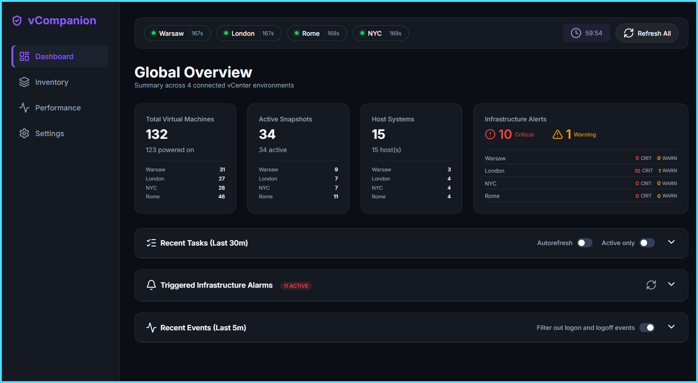
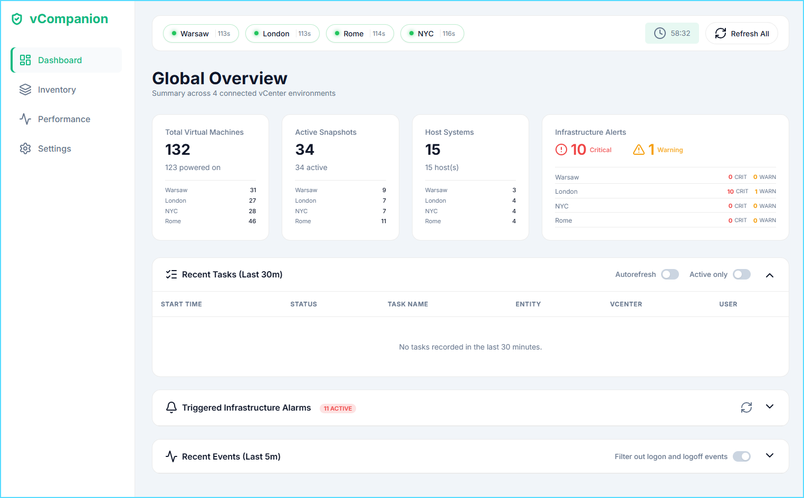
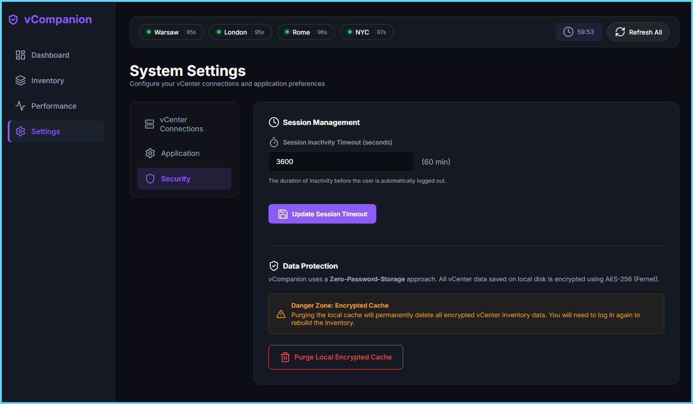

# 🛡️ vCompanion

[](https://www.python.org/)
[](https://www.vmware.com/products/vsphere.html)
[](LICENSE)
[](https://github.com/MaciejLukaszewicz/vCompanion)

**vCompanion** is a unified management dashboard for vSphere administrators. It lets you monitor and manage multiple, independent vCenter environments through a single, modern web interface — no federation required.

> [!NOTE]
> Designed for simplicity. Built for performance. Dedicated to administrators who manage diverse vSphere environments without the complexity of full federation.

---

## 📸 Screenshots

### Dashboard - Dark Mode

*Real-time monitoring with alerts, resource distribution, and performance metrics*

### Dashboard - Light Mode

*Clean, modern interface with customizable themes*

### Settings Panel

*Comprehensive configuration for vCenter connections, themes, and security*

---

## ✨ Key Features

### 🌐 Multi-vCenter Management
*   **Unified Inventory**: A clean, consistent view of all your resources (VMs, Hosts, Networks, Storage) across multiple vCenters
*   **Zero Federation Required**: Manage independent vCenter environments without complex federation setup
*   **Dynamic Status Indicators**: Real-time connection status with refresh progress
*   **Background Synchronization**: Intelligent worker that updates data automatically (configurable per-vCenter)

### 📊 Comprehensive Dashboard
*   **Proactive Monitoring**: High-level metrics for VMs, snapshots, hosts, and critical issues
*   **Time-Sorted Alerts**: Infrastructure alarms sorted by time with severity indicators (Critical, Warning, Info)
*   **Performance Metrics**: CPU, Memory, and Storage utilization across all hosts
*   **Cluster Resource Overview**: Detailed breakdown of cluster resources with capacity planning insights
*   **Recent Tasks & Events**: Live feed of vCenter tasks and events across all environments

### 🔍 Advanced Search & Discovery
*   **Global Search**: Instant search for VMs, IP addresses, and hosts across your entire infrastructure
*   **Indexed Cache**: Lightning-fast search using optimized cached data
*   **Cross-vCenter Results**: Single search query spans all connected environments

### 📂 Storage Management
*   **Storage Topology**: Dedicated view for Datastore Clusters and individual Datastores
*   **Visual Capacity Bars**: Color-coded capacity indicators with used/free space breakdown
*   **Storage Type Detection**: Distinguishes between local and shared storage
*   **Host Access Tracking**: Shows which hosts can access each datastore

### 🔗 Network Visualization
*   **Enhanced Networking**: Detailed visualization of Distributed and Standard switches
*   **VLAN Mapping**: Complete VLAN ID detection and portgroup association
*   **VMkernel Services**: Track enabled services (Management, vMotion, vSAN, FT, etc.) per adapter
*   **Network Labels**: Display portgroup names for each VMkernel interface

### 🖥️ Host Details
*   **Performance Metrics**: Real-time CPU, memory, and storage utilization per host
*   **Uptime Tracking**: Accurate uptime calculation with build information
*   **Network Profile**: Detailed networking configuration including VMkernel adapters
*   **Storage Profile**: Connected datastores with capacity and accessibility status
*   **Service Management**: Toggle SSH services on ESXi hosts directly from the UI (requires Elevated Privileges)

### 📸 Active Snapshot Management
*   **Global Snapshots Cockpit**: Centralized view of all snapshots across your entire infrastructure
- **Single & Batch Creation**: Take snapshots for one or many VMs simultaneously using a name list
*   **Smart Bulk Deletion**: Select multiple snapshots and delete them with a detailed confirmation preview (VM name, Snapshot name, Created at, Description)
*   **Automatic Task Tracking**: Live monitoring of snapshot tasks with real-time UI updates and toast notifications
*   **Optimized Performance**: Thread-safe caching and background refreshes prevent UI hangs during large-scale operations

### 🔓 Security & Privileged Operations
*   **Elevated Privileges**: Session-based locking for sensitive operations (like SSH toggles) to prevent accidental changes
*   **Visual Safety Indicators**: Shield icons and color-coded states indicate when privileged mode is active
*   **Zero Password Storage**: vCenter passwords are never stored on disk or in browser cookies
*   **Volatile RAM Keys**: Encryption keys derived from user passwords (PBKDF2) kept only in volatile memory
*   **AES-128 Encryption**: All cached data is encrypted with industry-standard encryption

### ⚙️ Settings Panel
*   **vCenter Management**: Add, edit, enable/disable, and remove vCenter connections
*   **Theme Customization**: Light/Dark mode with multiple accent color options (Blue, Purple, Emerald, Orange)
*   **Session Control**: Configurable session timeout with visual countdown timer
*   **Cache Management**: Manual cache purge for troubleshooting
*   **Refresh Intervals**: Per-vCenter and global refresh rate configuration

### 📈 Reporting & Export
*   **CSV Reports**: Generate detailed reports for inventory and critical events
*   **Time-Based Filtering**: Filter alerts by time periods (Last Day, Last Week)

### 🎨 Modern UI/UX
*   **Glassmorphism Design**: Modern, premium interface with smooth animations
*   **Responsive Layout**: Works seamlessly on desktop and tablet devices
*   **HTMX-Powered**: Dynamic updates without page reloads or complex JavaScript
*   **Lucide Icons**: Clean, modern iconography throughout the interface

---

## 🛠️ Tech Stack

| Layer | Technology |
|---|---|
| **Backend** | [FastAPI](https://fastapi.tiangolo.com/) + [Uvicorn](https://www.uvicorn.org/) |
| **Templating** | [Jinja2](https://jinja.palletsprojects.com/) |
| **Frontend** | [HTMX](https://htmx.org/) + Vanilla CSS |
| **vSphere API** | [pyvmomi](https://github.com/vmware/pyvmomi) |
| **Charts** | [ApexCharts](https://apexcharts.com/) |
| **Reporting** | [Pandas](https://pandas.pydata.org/) + [OpenPyXL](https://openpyxl.readthedocs.io/) |
| **Security** | PBKDF2 key derivation + AES-128 encryption |
| **Icons** | [Lucide](https://lucide.dev/) |

---

## 📋 Requirements

- **vCenter Server**: Version 7.0 Update 3 or later (vSphere 8.x fully supported)
- **Python**: Version 3.12 or newer
- **OS**: Windows (primary); Linux supported for manual setup
- **Connectivity**: Network access to managed vCenters on HTTPS (port 443)
- **Permissions**: Read-only credentials for vCenter access (AD or SSO)
- **Browser**: Any modern web browser with JavaScript enabled

---

## 🚀 Quick Start

### 1. Download & Install
You can either clone the repository or download the **[Latest Release](https://github.com/MaciejLukaszewicz/vCompanion/releases)** as a ZIP file.

**Option A: Git (recommended for easier updates)**
```powershell
git clone https://github.com/MaciejLukaszewicz/vCompanion.git
cd vCompanion
.\setup\setup.bat
```

**Option B: ZIP File**
1. Download and extract the ZIP to a folder.
2. Open PowerShell in that folder and run: `.\setup\setup.bat`

### 2. Configure
On first run, `config/config.json` is created automatically with a default template. Edit it to add your vCenter servers:

```json
{
  "app_settings": {
    "title": "vCompanion",
    "theme": "light",
    "accent_color": "blue",
    "session_timeout": 3600,
    "refresh_interval_seconds": 120,
    "port": 8000,
    "open_browser_on_start": true
  },
  "vcenters": [
    {
      "id": "prod",
      "name": "Production",
      "host": "vcenter-prod.example.com",
      "port": 443,
      "verify_ssl": false,
      "enabled": true,
      "refresh_interval": 180
    }
  ]
}
```

> **Tip:** You can also manage all settings through the web UI under **Settings** after logging in.

### 3. Run
```powershell
.\run.bat
```
The browser opens automatically at `http://localhost:8000`.

### 4. First Login
- Use your vCenter credentials (Active Directory or SSO)
- Select which vCenters to connect to
- The dashboard loads cached data immediately and refreshes in the background

---

## 🔄 Updates
Keep your installation up-to-date:
```powershell
.\setup\update.bat
```

---

## 📝 Documentation
- [Installation Guide](INSTALL.md) — detailed setup instructions
- [Technical Description](description.md) — architecture and internals

---

## 🧩 Plugin Architecture
vCompanion supports extension through filesystem-based plugins. A plugin is registered by placing a folder under `plugins/`; removing that folder unregisters it.

### How plugins work
- Each plugin lives in `plugins/<plugin_id>/`
- The host app and vCenter functionality remain fully operational even if plugins fail
- Plugins should be isolated: errors must not break the core vCenter workflow
- Plugin data can be stored separately from the main vCenter cache
- Plugins may provide:
  - their own REST/HTMX routes
  - their own templates and static assets
  - a sidebar menu item
  - a page in the Settings section
  - their own configuration files

### Plugin structure
A plugin should include:
- `manifest.json` — metadata and registration info
- `config.json` — optional plugin-specific configuration
- `plugin.py` — plugin bootstrap and registration code
- `routes.py` — plugin routes and endpoint definitions
- `client.py` — optional API client or integration helper
- `models.py` — optional Pydantic models for plugin data
- `templates/` — optional Jinja2 templates
- `static/` — optional plugin-specific CSS/JS/assets

### Plugin manifest
The manifest defines how the host app should load the plugin. Example fields:
- `id` — unique plugin identifier
- `name` — display name
- `description` — short description
- `module` — Python import path to plugin bootstrap module
- `enabled` — whether the plugin should be activated
- `sidebar` — optional sidebar registration
- `settings` — optional settings page registration

### Sidebar and Settings integration
- Plugins may register a sidebar item for their main UI page
- Plugins may also add a dedicated Settings section
- This allows plugins to integrate cleanly into the existing app navigation

### Configuration and isolation
- Global app config remains in `config/config.json`
- Plugin-specific configuration may be stored in `plugins/<plugin_id>/config.json`
- Plugin lifecycle must be independent from core app lifecycle
- The core vCenter application must continue operating normally, regardless of plugin state

### Security & Isolation (Security by Design)
- Plugins MUST NOT access arbitrary filesystem paths inside the application workspace (including other plugin folders or `config/`).
- Plugins MUST NOT access the central cache or plugin data stores directly via file reads; they may only use the provided `PluginContext.cache` API.
- The host app enforces a permissions model declared in `manifest.json` (e.g. `permissions: ["storage:read","storage:write","routes","sidebar"]`).
- Plugin loading is wrapped in error handlers; a failing plugin must not prevent the main app or other plugins from running.
- For stronger isolation, consider running untrusted plugins in subprocesses or containers (future enhancement).

Implementation notes:
- The host provides a `PluginContext` API to plugins that exposes only allowed functionality (`register_router`, `register_templates`, `cache.set/get/delete`, logger, and limited settings access).
- All plugin data saved through the `PluginContext.cache` is stored in an encrypted area scoped to the plugin id (e.g. `plugins.<plugin_id>`) and cannot be read by other plugins or by direct filesystem access.
- Manifest-declared permissions are checked during plugin registration; operations outside the declared permissions are denied and logged.

### Example plugin location
`plugins/veeam/` is the first plugin example for Veeam Backup Server integration.

---

## 🎯 Use Cases

- **Multi-Site Management**: Oversee production, DR, and development vCenters from one interface
- **Capacity Planning**: Track resource utilization and plan for growth
- **Incident Response**: Quickly identify and respond to infrastructure alerts
- **Compliance Reporting**: Generate reports for audits and documentation
- **Network Troubleshooting**: Visualize network topology and VMkernel configurations

---

## 🤝 Contributing
Feedback and contributions are welcome! Please feel free to submit issues or pull requests.

---

## 📄 License
This project is licensed under the Creative Commons Attribution-NonCommercial-ShareAlike 4.0 International (CC BY-NC-SA 4.0) - see the [LICENSE](LICENSE) file for details.

---

*vCompanion — Managing vSphere has never looked this good.*
