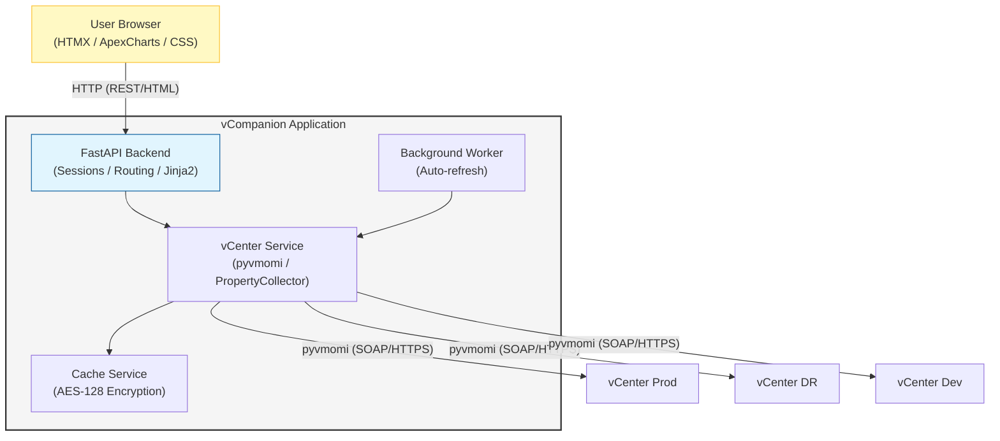

# vCompanion - Technical Description

vCompanion is a comprehensive management tool designed to help administrators oversee multiple vSphere environments without requiring federation. It provides a unified, modern web interface for monitoring and managing independent vCenter Server instances.

---

## 1. Environment Requirements

### vCenter Infrastructure
- **vCenter Server**: Version 7.0 Update 3 or later
- **Connectivity**: All managed vCenters must be accessible from the host system running vCompanion
- **Authentication**: All vCenter servers must support management via the same set of credentials (Active Directory or SSO)
- **Permissions**: Read-only access is sufficient for all monitoring and reporting features
- **Network**: HTTPS traffic (default port 443) must be allowed between vCompanion and all managed vCenters
- **Certificate Validation**: SSL certificate verification can be disabled for self-signed certificates

### System Requirements
- **Operating System**: Windows (primary) or Linux
- **Python**: Version 3.12 or later
- **Memory**: Minimum 2GB RAM (4GB recommended for multiple vCenters)
- **Storage**: 500MB for application and cache files
- **Network**: Stable network connection to all managed vCenters

---

## 2. Application Requirements

### User Interface
- **Web-Based**: Modern, responsive web interface accessible via any modern browser
- **Theme Support**: Light and Dark modes with customizable accent colors (Blue, Purple, Green, Orange, Red)
- **Responsive Design**: Optimized for desktop and tablet devices
- **Real-Time Updates**: Dynamic content updates using HTMX without full page reloads
- **Visual Feedback**: Loading indicators, status badges, and progress bars for better UX

### Runtime Environment
- **Python 3.12+**: Supported on Linux and Windows (Windows is the primary testing platform)
- **Virtual Environment**: Automatic venv creation and dependency management via setup scripts
- **Zero Configuration**: Minimal manual configuration required for initial setup
- **Hot Reload**: Development mode with automatic code reloading on file changes

### Configuration Management
- **JSON-Based**: Simple `config/config.json` file for all settings
- **Per-vCenter Settings**: Individual refresh intervals and connection parameters
- **Application Settings**: Global theme, session timeout, and UI preferences
- **Runtime Updates**: Settings can be modified through the web interface

### Deployment & Updates
- **Git-Based**: Deployable and updatable via Git from GitHub
- **Automated Setup**: One-command installation via `setup.bat`
- **Update Script**: Simple `update.bat` for pulling latest changes
- **Version Control**: Full Git integration for tracking changes and rollbacks

---

## 3. Technical Stack

### Backend Framework
- **FastAPI**: High-performance, modern ASGI framework with automatic API documentation
- **Uvicorn**: Lightning-fast ASGI server with auto-reload support
- **Jinja2**: Powerful templating engine for server-side rendering
- **Starlette**: Lightweight ASGI framework for sessions and middleware

### API Integration
- **pyvmomi**: Official VMware vSphere API Python bindings
- **PropertyCollector**: Efficient bulk data retrieval from vCenter
- **Session Management**: Persistent vCenter sessions with automatic reconnection
- **Error Handling**: Robust error handling for network issues and API failures

### Frontend Technologies
- **HTML5/CSS3**: Modern, semantic markup with advanced CSS features
- **HTMX**: Dynamic updates without complex JavaScript frameworks
- **ApexCharts**: Beautiful, interactive charts for performance visualization
- **Lucide Icons**: Clean, modern iconography
- **Glassmorphism**: Modern UI design with frosted glass effects

### Data Processing
- **Pandas**: Advanced data analysis and manipulation
- **OpenPyXL**: Excel report generation
- **JSON**: Lightweight data serialization for caching
- **Cryptography**: AES-128 encryption for sensitive cached data

### Security
- **PBKDF2**: Key derivation function for password-based encryption
- **AES-128**: Industry-standard encryption for cached credentials
- **Session Cookies**: Secure, HTTP-only session management
- **CSRF Protection**: Built-in cross-site request forgery protection
- **Volatile Keys**: Encryption keys stored only in RAM, never on disk

### Logging & Monitoring
- **Rotating File Logs**: Automatic log rotation to prevent disk space issues
- **Structured Logging**: Consistent log format for easy parsing
- **Debug Mode**: Detailed logging for troubleshooting
- **Performance Metrics**: Internal timing for performance optimization

---

## 4. Core Features

### Multi-vCenter Management
- **Unified Inventory**: Consolidated view of VMs, Hosts, Datastores, and Networks across all vCenters
- **Independent Connections**: Each vCenter maintains its own session and refresh cycle
- **Status Monitoring**: Real-time connection status with visual indicators
- **Selective Login**: Choose which vCenters to connect to during login
- **Connection Testing**: Validate vCenter connectivity before saving configuration

### Intelligent Caching
- **AES-128 Encrypted Cache**: All cached data is encrypted using keys derived from user passwords
- **Background Refresh**: Automatic data synchronization every 2 minutes (configurable)
- **Instant Display**: Cached data shown immediately after login for fast UI response
- **Selective Updates**: Only changed data is updated to minimize API calls
- **Cache Invalidation**: Manual cache purge option for troubleshooting

### Dashboard & Monitoring
- **Resource Overview**: Total VMs, Hosts, Datastores, and Clusters across all environments
- **Alert Management**: Time-sorted infrastructure alarms with severity filtering
- **Performance Charts**: CPU, Memory, and Storage utilization with ApexCharts
- **Snapshot Tracking**: Identify VMs with snapshots and their age
- **Cluster Resources**: Detailed breakdown of cluster CPU, memory, and host distribution

### Inventory Management
- **Virtual Machines**: Comprehensive VM listing with power state, resources, and IP addresses
- **ESXi Hosts**: Detailed host information including version, uptime, and performance
- **Datastores**: Storage capacity, type (local/shared), and host connectivity
- **Networks**: Distributed and Standard switches with VLAN and portgroup details

### Storage Topology
- **Datastore Clusters**: Hierarchical view of storage clusters and member datastores
- **Capacity Visualization**: Color-coded capacity bars with used/free space
- **Storage Types**: Automatic detection of local vs. shared storage
- **Host Access Matrix**: Shows which hosts can access each datastore
- **Capacity Planning**: Total and available capacity across all storage

### Network Visualization
- **Distributed Switches (DVS)**: Complete DVS topology with portgroups and VLANs
- **Standard Switches (VSS)**: Host-level standard switch configuration
- **VMkernel Adapters**: Detailed VMkernel interface information
- **Service Detection**: Automatic identification of enabled services (Management, vMotion, vSAN, FT, etc.)
- **VLAN Mapping**: VLAN ID tracking for all portgroups

### Host Details
- **System Information**: ESXi version, build number, hardware model
- **Performance Metrics**: Real-time CPU, memory, and storage utilization
- **Uptime Calculation**: Accurate uptime tracking with boot time
- **Network Configuration**: All VMkernel adapters with IP, subnet, and services
- **Storage Profile**: Connected datastores with capacity and accessibility

### Advanced Settings
- **vCenter Management**: Add, edit, remove, and test vCenter connections
- **Theme Customization**: Choose between Light/Dark modes and accent colors
- **Session Control**: Configurable session timeout (300-7200 seconds)
- **Refresh Intervals**: Per-vCenter data refresh rate (60-600 seconds)
- **Cache Management**: Manual cache purge and encryption key reset

### Security Features
- **Zero Password Storage**: Passwords never written to disk or cookies
- **Volatile Encryption Keys**: Keys exist only in server RAM
- **Session Timeout**: Automatic logout after configurable inactivity period
- **Session Countdown**: Visual timer showing remaining session time
- **Auto-Invalidation**: Server restart clears all encryption keys
- **HTTPS Ready**: Can be deployed behind reverse proxy for SSL termination

### Reporting & Export
- **Excel Reports**: Generate detailed Excel workbooks with Pandas
- **CSV Export**: Export data in CSV format for external analysis
- **Time-Based Filtering**: Filter alerts by time periods (Last Day, Last Week, All)
- **Snapshot Reports**: Identify VMs with old snapshots for cleanup
- **Capacity Reports**: Storage and compute capacity planning data

### Search & Discovery
- **Global Search**: Search across all vCenters simultaneously
- **VM Search**: Find VMs by name with fuzzy matching
- **IP Address Search**: Locate VMs by IP address
- **Host Search**: Find ESXi hosts by name or IP
- **Indexed Cache**: Fast search using optimized cached data

---

## 5. Architecture Overview

### Application Structure
```
vCompanion/
├── app/
│   ├── api/              # API route handlers
│   ├── services/         # Business logic and vCenter integration
│   ├── models/           # Data models and schemas
│   └── utils/            # Utility functions and helpers
├── config/               # Configuration files
├── templates/            # Jinja2 HTML templates
│   ├── partials/         # Reusable template components
│   └── base.html         # Base template with common layout
├── static/               # Static assets (CSS, images)
├── setup/                # Installation and update scripts
└── main.py               # Application entry point
```

### Data Flow


### Session Management
1. **Login**: User provides credentials and selects vCenters
2. **Key Derivation**: PBKDF2 generates encryption key from password
3. **vCenter Authentication**: Credentials validated against selected vCenters
4. **Cache Encryption**: vCenter sessions encrypted with derived key
5. **Session Cookie**: Secure session cookie issued to browser
6. **Background Sync**: Worker thread refreshes data periodically
7. **Auto-Logout**: Session expires after configured timeout

### Cache Strategy
- **Write-Through**: Data written to cache immediately after retrieval
- **Background Refresh**: Periodic updates without blocking UI
- **Encryption at Rest**: All cached data encrypted with AES-128
- **Memory-Only Keys**: Encryption keys never persisted to disk
- **Selective Invalidation**: Individual cache entries can be purged

---

## 6. Performance Optimization

### Efficient Data Retrieval
- **PropertyCollector**: Bulk data retrieval minimizes API calls
- **Selective Properties**: Only required properties fetched from vCenter
- **Parallel Requests**: Multiple vCenters queried simultaneously
- **Connection Pooling**: Persistent vCenter sessions reduce overhead

### Caching Strategy
- **Encrypted JSON Cache**: Fast local cache reduces vCenter load
- **Background Updates**: UI remains responsive during refresh
- **Incremental Updates**: Only changed data synchronized
- **Memory Efficiency**: Cache size limited to prevent memory issues

### Frontend Optimization
- **HTMX Partial Updates**: Only changed DOM elements updated
- **Lazy Loading**: Charts and tables loaded on demand
- **CSS Animations**: Hardware-accelerated transitions
- **Minimal JavaScript**: Reduced client-side processing

---

## 7. Documentation Standards

### Code Comments
- **Language**: All code comments in English
- **Docstrings**: Python functions documented with docstrings
- **Inline Comments**: Complex logic explained with inline comments
- **Type Hints**: Python 3.12+ type annotations throughout

### User Documentation
- **Installation Guide**: Step-by-step instructions for non-technical users
- **Configuration Guide**: Detailed explanation of all settings
- **Troubleshooting**: Common issues and solutions
- **Screenshots**: Visual guides for key features

### Developer Documentation
- **Architecture Overview**: High-level system design
- **API Documentation**: FastAPI automatic documentation
- **Code Structure**: Explanation of directory layout
- **Contributing Guide**: Guidelines for contributors

---

## 8. Future Enhancements

### Planned Features
- **VM Operations**: Power on/off, snapshot management
- **Task Monitoring**: Track vCenter tasks in real-time
- **Custom Dashboards**: User-configurable dashboard widgets
- **Email Alerts**: Notification system for critical events
- **Multi-User Support**: Role-based access control
- **API Endpoints**: RESTful API for external integrations
- **Mobile App**: Native mobile application for iOS/Android

### Performance Improvements
- **Redis Cache**: Optional Redis backend for distributed caching
- **WebSocket Updates**: Real-time updates without polling
- **Database Backend**: Optional PostgreSQL for large deployments
- **Horizontal Scaling**: Multi-instance deployment support

---

*This document provides a comprehensive technical overview of vCompanion. For installation instructions, see README.md.*
