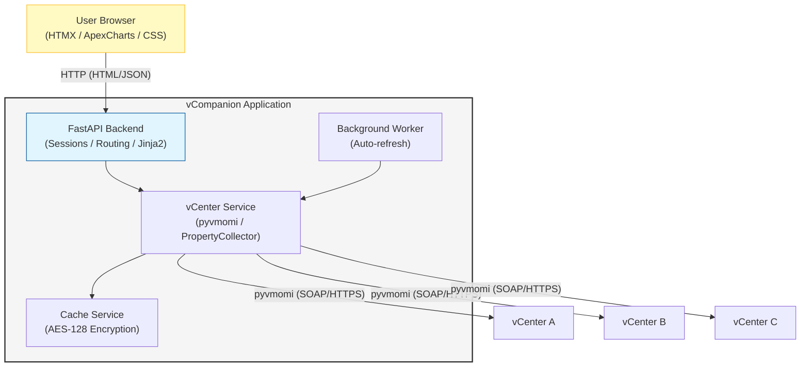

# vCompanion — Technical Description

vCompanion is a comprehensive management tool designed to help administrators oversee multiple vSphere environments without requiring federation. It provides a unified, modern web interface for monitoring and managing independent vCenter Server instances.

---

## 1. Environment Requirements

### vCenter Infrastructure
- **vCenter Server**: Version 7.0 Update 3 or later (vSphere 8.x fully supported)
- **Connectivity**: All managed vCenters must be accessible from the host running vCompanion on HTTPS (port 443)
- **Authentication**: All vCenter servers must support authentication via the same set of credentials (Active Directory or SSO)
- **Permissions**: Read-only access is sufficient for all monitoring and reporting features
- **Certificate Validation**: SSL certificate verification can be disabled per-vCenter for self-signed certificates

### System Requirements
- **Operating System**: Windows (primary); Linux supported for manual setup
- **Python**: Version 3.12 or later
- **Memory**: Minimum 2 GB RAM (4 GB recommended for 4+ vCenters)
- **Storage**: ~500 MB for application, virtual environment, and encrypted cache files
- **Network**: Stable connection to all managed vCenters

---

## 2. Technical Stack

### Backend
- **FastAPI** — high-performance ASGI framework with automatic API documentation
- **Uvicorn** — ASGI server
- **Jinja2** — server-side HTML templating
- **Starlette** — session middleware and request handling

### vSphere Integration
- **pyvmomi** — official VMware vSphere API Python bindings
- **PropertyCollector** — efficient bulk data retrieval from vCenter
- Persistent vCenter sessions with automatic reconnection on failure

### Frontend
- **HTMX** — dynamic partial page updates without a JavaScript framework
- **Vanilla CSS** — custom design system with CSS variables for theming
- **ApexCharts** — interactive performance charts
- **Lucide Icons** — icon set

### Data & Reporting
- **Pandas** — data analysis and Excel report generation
- **OpenPyXL** — Excel workbook creation
- **JSON** — lightweight cache serialization

### Security
- **PBKDF2** — key derivation from user password (never stored)
- **AES-128** (via `cryptography` library) — encryption of all cached data at rest
- **Volatile keys** — encryption keys exist only in server RAM; server restart invalidates all sessions
- **Starlette sessions** — signed, HTTP-only session cookies

---

## 3. Architecture Overview

### Directory Structure
```
vCompanion/
├── app/
│   ├── api/              # Route handlers (dashboard, inventory, settings, auth...)
│   ├── core/             # Config loading, session management
│   └── services/         # vCenter service, cache management
├── config/               # config.json (gitignored, auto-created on first run)
├── data/                 # Encrypted cache files (gitignored)
├── templates/            # Jinja2 HTML templates
│   ├── partials/         # Reusable HTMX partial templates
│   └── base.html         # Base layout with sidebar, session timer, notifications
├── static/               # CSS, images
├── setup/                # setup.bat, update.bat
├── run.bat               # Application launcher
└── main.py               # Entry point, page routes
```

### Data Flow


### Session & Security Flow
1. **Login** — user provides credentials and selects vCenters to connect to
2. **Key Derivation** — PBKDF2 generates an in-memory encryption key from the password
3. **vCenter Authentication** — credentials validated against each selected vCenter via pyvmomi
4. **Cache Unlock** — existing encrypted cache is decrypted using the derived key
5. **Session Cookie** — a signed session cookie is issued to the browser (username only, no password)
6. **Background Sync** — a worker thread refreshes vCenter data on a configurable interval
7. **Auto-Logout** — session expires after a configurable inactivity timeout; stale cookies are invalidated server-side

---

## 4. Core Features

### Multi-vCenter Management
- Unified inventory across all connected vCenters (VMs, Hosts, Datastores, Networks)
- Each vCenter maintains its own independent session and refresh cycle
- vCenters can be individually enabled/disabled without removing them from config
- Real-time connection status indicators per vCenter

### Intelligent Caching
- All cached data encrypted with AES-128 using keys derived from the user's password
- Background refresh keeps data current without blocking the UI
- Cached data displayed immediately after login for fast response
- Manual cache purge available in Settings for troubleshooting

### Dashboard
- Aggregated resource counts (VMs, Hosts, Snapshots) across all vCenters
- Time-sorted infrastructure alerts with severity filtering (Critical, Warning, Info)
- Recent tasks and events feed
- Per-vCenter connection status panel

### Inventory
- **Virtual Machines** — power state, CPU/memory, IP addresses, snapshot status
- **ESXi Hosts** — version, uptime, CPU/memory utilization, network and storage profile
- **Datastores** — capacity, type (local/shared), host connectivity
- **Networks** — Distributed and Standard switches, VLANs, portgroups, VMkernel services
- Search and CSV export for all inventory tables

### Performance
- Top VMs and Hosts by CPU and memory usage
- Cluster resource overview with CPU, memory, and storage utilization percentages

### Storage
- Datastore Clusters with nested Datastores
- Visual capacity bars (color-coded: green/amber/red)
- Host access matrix per datastore

### Settings
- Add, edit, enable/disable, and remove vCenter connections
- Light/Dark theme toggle and accent color selection (applied immediately)
- Session timeout configuration
- Global and per-vCenter refresh interval
- Cache purge and server restart/shutdown controls

### Security
- Zero password storage — passwords never written to disk or cookies
- Encryption keys exist only in RAM; server restart invalidates all sessions
- Session inactivity timeout with visual countdown timer
- Stale session cookies invalidated server-side on expiry

---

## 5. Configuration

All configuration is stored in `config/config.json`. This file is excluded from version control (`.gitignore`) and is created automatically with defaults on first run.

Settings can be modified:
- **Directly** — by editing `config/config.json`
- **Via UI** — through the Settings panel in the web interface (changes saved immediately)

See [INSTALL.md](INSTALL.md) for the full configuration reference.

---

## 6. Performance

- **PropertyCollector** bulk API calls minimize round-trips to vCenter
- **Parallel refresh** — all vCenters refreshed concurrently in background threads
- **HTMX partial updates** — only changed DOM fragments are replaced, no full page reloads
- **Encrypted JSON cache** — fast local reads reduce vCenter API load between refresh cycles
