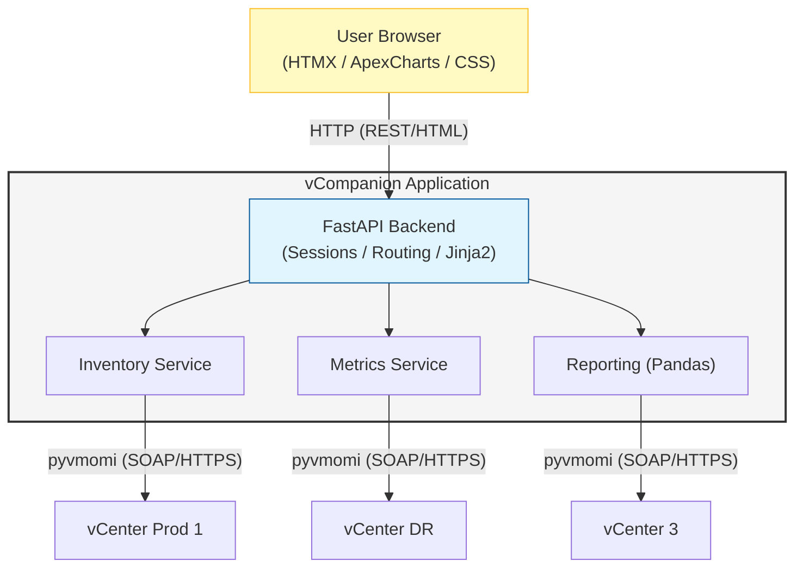

# vCompanion

vCompanion is a management tool designed to help administrators oversee multiple vSphere environments without requiring federation.

## 1. Environment Requirements
- **vCenter Server**: Version 7.0 Update 3 or later.
- **Connectivity**: All managed vCenters must be accessible from the host system running vCompanion.
- **Authentication**: All vCenter servers must support management via the same set of credentials (AD or SSO). Read only access is sufficient.
- **Network**: HTTPS traffic (default port 443) must be allowed between vCompanion and all managed vCenters.

## 2. Application Requirements
- **Interface**: Web-based user interface (Modern, responsive, with dark mode).
- **Runtime**: Python 3.12 or later (supported on Linux and Windows; Windows is the primary testing platform). The initialization script will automatically create the Virtual Environment (venv) and install all required libraries (assuming Python is already installed).
- **Configuration**: vCenter list and application settings provided via a JSON configuration file.
- **Deployment**: The application must be deployable and updatable via Git from GitHub.
- **Technical Stack**:
    - **Backend**: FastAPI (high performance, modern ASGI framework).
    - **API Integration**: `pyvmomi` (official VMware vSphere API Python bindings).
    - **Frontend**: Clean HTML5/CSS3 with HTMX for dynamic updates without complex JS frameworks. Charting via `ApexCharts`.
    - **Data Handling**: `pandas` and `openpyxl` for report generation.
    - **Authentication**: Native vSphere SSO integration for session management.
    - **Logging**: Rotating file logs for easy troubleshooting.

## 3. Features
- **Unified Inventory**: A clean, consistent view of resources across all connected vCenters, powered by an encrypted (AES-128) JSON caching layer.
- **Advanced Settings**: Dedicated panel for managing vCenter connections, customizing application themes (Light/Dark mode, Accent colors), and configuring security policies (Session timeout).
- **Storage Topology**: Unified management of Datastore Clusters and individual Datastores. Provides visual capacity bars, distinguishes between local and shared storage, and tracks host connectivity.
- **Enhanced Networking**: Comprehensive mapping of Distributed Virtual Switches (DVS) and Standard Switches (VSS). Includes VLAN ID detection, portgroup association, and detailed VMkernel service tracking (Management, vMotion, vSAN, etc.).
- **Detailed Host Overview**: In-depth host performance metrics, uptime calculation, build information, and a dedicated networking/storage profile for each ESXi server.
- **Zero-Password-Storage**: For maximum security, vCenter passwords are never stored on disk or in browser cookies.
- **Volatile RAM Keys**: Encryption keys are derived from user passwords (using PBKDF2) and kept only in volatile memory (RAM).
- **Background Refresh**: Intelligent background worker that synchronizes data from vCenters every 2 minutes (configurable per-vCenter).
- **Dashboard Cache**: Displays cached data immediately after login, with background updates ensuring the UI stays fresh without blocking the user.
- **Dynamic Status Indicators**: Real-time status pills in the header showing connection states and refresh progress with countdown timers.
- **Global Search**: Search for VMs, IP addresses, and hosts across all environments simultaneously using indexed cached data.
- **Session Management**: Secure sessions after login with a configurable inactivity timeout. Server restarts invalidate keys for security.
- **Alerting & Reporting**: Integrated reporting capabilities (Excel/Pandas) for critical events and inventory. sorted by time for better visibility.

## 4. Architecture Diagram

## 5. Documentation
- **Code comments**: Code comments should be in English.
- **Installation guide**: Installation guide should be in English, easy to follow even for non-technical users, which should include step-by-step instructions for setting up the application using Git. Will be used by persons that don't know anything about Python or web development.
- **Updates**: Provide a simple method (e.g., a script) to pull the latest changes from GitHub via Git.

